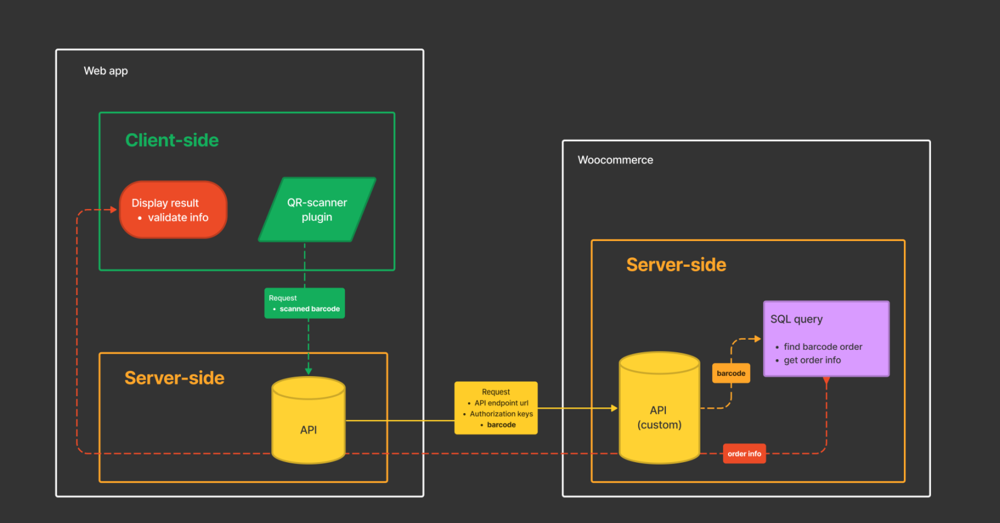

## QR-scanner PWA

**Extra-simple demo** of QR/barcode scanner app created for checking valid Woocommerce orders.

### Dependencies

> - Next.js (React), next-pwa
> - [Html5-QRCode](https://github.com/mebjas/html5-qrcode)
> - [Moment.js](https://momentjs.com/)

#

### Diagram



#

### Progressive Web App builded with

```bash
npx create-next-app --example progressive-web-app progressive-web-app
```

> Uses [`next-pwa`](https://github.com/shadowwalker/next-pwa) to create a progressive web app (PWA) powered by [Workbox](https://developers.google.com/web/tools/workbox/).
